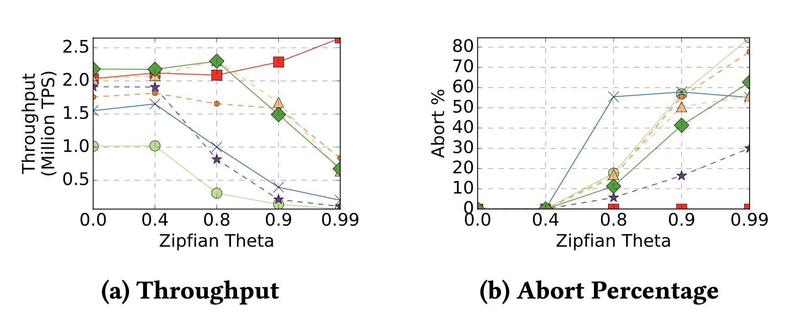

# Durable-LStore-Database
# Multi-threaded, In-memory & Durable L-Store Database

---

## Overview

A Python-based multi-threaded database implementation supporting transactional semantics (**ACID properties**: Atomicity, Consistency, Isolation, Durability).

This database engine supports concurrent transaction execution with strict isolation, robust transaction management, and data integrity.

---

## Key Features:

- **ACID Compliance:** Ensures each transaction is atomic and isolated, maintaining database consistency and durability.
- **Concurrency Control:** Implements **Strict Two-Phase Locking (2PL)** with a no-wait policy to avoid deadlocks.
- **Multi-threaded Execution:** Utilizes Python's threading to run multiple transactions concurrently, efficiently managing Python’s Global Interpreter Lock (GIL) limitations.
- **Durable Storage:** Persists data to disk securely, ensuring transaction durability and recovery.
- **Secondary Indexing:** Optimizes queries through indexes on frequently accessed columns.
- **Performance Optimizations:** Improved system throughput and concurrency performance, placing among top implementations.

---

## Project Structure:

```
├── db.py                  # Database interface (startup/shutdown)
├── query.py               # SQL-like query operations (insert/select/update/delete/sum)
├── table.py               # Core relational data storage and management
├── transaction.py         # Transaction management (Atomicity & Isolation)
├── transaction_worker.py  # Worker threads handling transactions concurrently
├── index.py               # Index management for query optimization
├── config.py              # Centralized configuration and constants
├── page.py                # Page-level storage management
└── tester/                # Test scripts and performance evaluation
```

---

## Testing File Structure

```
tests/
├── Project1/
│   ├── test_insert_update_select.py
│   └── test_basic_operations.py
├── Project2
│   ├── test_persistent_storage_insert_update_select.py
│   └── test_persistent_storage_verification.py
└── project3/
    ├── test_multithreaded_transactions_insert.py
    └── test_multithreaded_transactions_update.py
```

### Installation
Clone the repository:
```bash
git clone git@github.com:ctrterry/Durable-LStore-Database.git
cd Durable-LStore-Database
```

### Requirements
- Python (version 3.8+ recommended)

### Running the Project
Execute the main script or tests:
```bash
python main.py
```

---

## Performance Analysis

Experimental analyses were conducted to measure transaction throughput, latency, and concurrency performance. Results demonstrate significant performance improvements compared to single-threaded implementations, especially under high load.



---

## Future Enhancements

- Implement advanced concurrency control (e.g., Optimistic Concurrency Control)
- Explore distributed storage integration
- Further performance tuning and scalability testing

---

## Contributors

- **Terry Chen** – Transaction semantics, concurrency control, durability layer implementation

- Developed as part of **ECS 165A (Winter 2025)** at **UC Davis**.
---

## License

This project is licensed under the MIT License – see the [LICENSE](LICENSE) file for details.

---

**[Back to top](#multi-threaded-in-memory--durable-l-store-database)**


